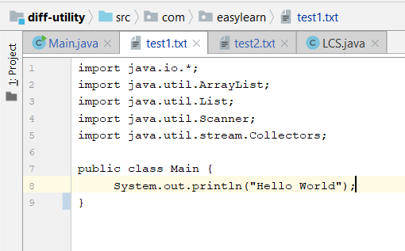

# diff-utility
This java based utility shows the diff between two text based files.
The underlying solution is an implementation of the Longest Common Subsequence algorithm.

INPUT1 : test1.txt                        |  INPUT2 : test2.txt                      
:----------------------------------------:|:----------------------------------------:
  |   

OUTPUT
:----------------------------------------:
 |
